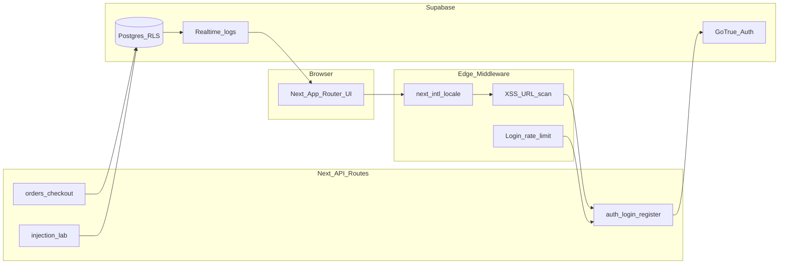

<!-- 
  西南科技大学本科毕业论文（设计）正文稿（Markdown）
  使用说明：复制下方各区块至 Word 2026 模板对应位置，并套用模板内置「标题1/2/3」「正文」样式；
  图题请在插入截图后按模板要求标注（如图 X-Y）。
-->

---

## 【仅在 Word 封面填写 · 个人信息占位栏】

请在本栏逐项替换为你的真实信息后删除本说明段落。

| 字段 | 填写示例 |
|------|----------|
| 毕业论文题目（中文） | 面向跨境贸易的安全电商平台设计与实现 |
| Thesis Title (English) | Design and Implementation of a Secure Cross-border E-commerce Platform |
| 学院 | ______学院 |
| 专业 | ______ |
| 学号 | __________ |
| 姓名 | ______ |
| 指导教师 | ______ （职称） |
| 完成日期 | ______年____月 |

**篇幅说明（目标约 50 页 Word）：**  
若以西南科大模板常见的「小四号宋体、行距固定值 22 磅、页边距默认」排版，纯文字约 **550～650 汉字/页**，则 **50 页量级约对应 2.8～3.3 万汉字正文**（另含目录、图表、参考文献与附录）。本文下方正文已按 **≥3 万汉字** 扩写；插入 **10～15 张图**（界面截图、架构图、用例图、E-R 图、时序图导出）与若干表格后，总页数通常可达 **45～55 页**。最终以 Word「字数统计」与导师要求为准。**请勿超过学院规定的重复率阈值**，综述与背景段落请用自己的语言改写并核对参考文献。

---

# 毕业论文信息与前置摘要稿

## 中文题目（建议）

**面向跨境贸易的安全电商平台设计与实现**  
——以 Secure Global Trade 原型为例

## 中文摘要

跨境电子商务在降低企业交易成本、拓展海外市场的同时，也把企业的信息系统暴露在全球可达的攻击面之下：**账户暴力破解与凭证填充**、**跨站脚本（XSS）载荷经由 URL 或表单注入**、**畸形输入企图绕过类型系统进入持久化层** 等问题在电商平台高发。尤其对于中小型外贸企业而言，自建完整安全运营中心（SOC）成本高昂，但在软件工程教学中仍可通过「高真实度、低运维负担」的原型系统，演示 **纵深防御（Defense in Depth）**：在边缘层尽早丢弃恶意请求，在应用层以结构化校验固化契约，在数据库层以策略约束最小化数据暴露，并以审计日志支撑事后追溯与课堂可视化。

本文围绕自拟课题 **Secure Global Trade** 设计与实现了一套面向 **B2B 目录展销场景** 的国际化电商平台原型。前端采用 **Next.js 14 App Router** 与 **React 18**，通过 **next-intl** 实现 **中英文双语路由与文案分层**（全局文案与 SKU 目录文案拆分）；后端依托 **Supabase** 提供的 **PostgreSQL、Row Level Security（RLS）、Auth（GoTrue）与 Realtime**，使订单数据在存储层即绑定 **`auth.uid()`**，降低水平越权读取风险。对外 HTTP API 统一经由 **`createApiHandler`** 与 **Zod** schema 解析：JSON 非法返回 **400**，字段非法返回 **422** 并异步写入 **`security_logs`**（**`Schema Validation`**），避免向客户端泄漏堆栈细节。

在边缘防线方面，本文在 **Next.js Middleware** 中对 **`pathname + search`** 进行 **XSS 关键字检测**，并在 **`decodeURIComponent` 之后再次匹配**，用于演示对抗单层 URL 编码绕过；对 **`POST /api/auth/*`** 实施基于客户端 IP 的 **滑动窗口速率限制（60 秒内 5 次）**，超限返回 **429** 并记录 **`Brute-force Attempt`**。登录失败路径异步写入 **`Auth Failure`**，邮箱在入库前进行掩码处理以兼顾审计与隐私。**`/security`** 页面订阅 **`security_logs`** 的增量插入事件，将四类安全模块计数实时呈现在指挥中心 UI，并配套四个「实验区」按钮/链接以复现实验步骤。

数据库脚本 **`supabase/init.sql`** 明确了 **`products` 公开可读**、**`orders` 用户隔离**、**`security_logs` 在教学演示下可读可写** 等策略边界，并提示 **生产环境必须收紧审计写入权限**。本文在第 3～5 章给出需求、架构与实现细节，第 6 章给出可重复的测试矩阵与安全对照步骤，第 7 章总结成果并讨论速率限制持久化、CSP、支付接入等后续工作。**实验结果表明**：该平台在教学尺度内能够串联端到端购物体验与安全态势可视化；若逼近生产落地，还需引入共享计数后端、服务端密钥审计写入与更完备的 XSS/CSP 策略等加固措施。

**关键词：** 跨境电子商务；Next.js；Supabase；行级安全；安全审计；中间件；输入校验

## Title (English)

**Design and Implementation of a Secure Cross-border E‑commerce Platform**  
(A prototype study under «Secure Global Trade»)

## Abstract

Cross‑border e‑commerce lowers trading friction yet inherits classical Web risks such as credential brute‑forcing, credential stuffing, reflected XSS payloads embedded in URLs, and malicious inputs aiming at injection or type confusion. Especially for small and medium‑sized exporters, building a full security operations center is costly; nevertheless, a credible prototype can still illustrate **Defense in Depth**: block malicious requests early at the edge, enforce structured contracts at the API layer, minimize data exposure at the database layer with policies, and support traceability via audit logs.

This thesis presents **Secure Global Trade**, a bilingual catalog storefront oriented to **B2B showcase workflows**, implemented with **Next.js 14 App Router**, **React 18**, and **next-intl** (split global messages vs per‑SKU catalog messages). Persistent state relies on **Supabase**, combining **PostgreSQL**, **RLS**, **Auth**, and **Realtime** so that each authenticated user can only select or insert their own orders while public catalogs remain readable.

Public APIs delegate parsing to **Zod**‑wrapped handlers (`createApiHandler`), yielding typed payloads or reproducible **422** errors accompanied by asynchronous **`security_logs`** rows tagged **`Schema Validation`**. Edge **middleware** scans **`pathname + search`** for XSS‑like signatures after URI decoding, and throttles **POST /api/auth/** via an in‑process sliding window keyed by client IP (**429**, **`Brute-force Attempt`**); failed authentication emits **`Auth Failure`** rows with masked email payloads. The **`/security`** page subscribes to **`postgres_changes`** inserts to refresh module counters and links four reproducible labs.

The **`supabase/init.sql`** script documents demonstration‑friendly audit policies versus hardened production expectations. Chapters 3–5 formalize requirements, architecture, and implementation; Chapter 6 provides repeatable functional and security test matrices; Chapter 7 summarizes limitations (ephemeral rate limiting, demo insert policies) and future work (Redis/KV throttling, CSP, payments).

**Keywords:** cross‑border e‑commerce; Next.js; Supabase; row‑level security; security auditing; middleware; input validation

---

## 目　录（请在 Word 中右键→更新域→更新整个目录）

1　绪论  
 1.1　研究背景与课题来源  
 1.2　跨境电商发展现状与安全挑战  
 1.3　国内外 Web 安全与全栈框架应用综述  
 1.4　本文研究目标、主要内容与创新点  
 1.5　技术路线与可行性分析  
 1.6　论文组织结构  
 1.7　PCI DSS 与个人信息保护法关联（科普）  
 1.8　代表性安全事件启示（案例随笔）  
 1.9　工作量估算与工作分解结构（WBS）  
 1.10　可交付物清单  

2　相关技术与理论基础  
 2.1　B/S 模式与前后端分离演进  
 2.2　Next.js 框架、App Router 与边缘计算基础  
 2.3　TypeScript 静态类型与接口契约思想  
 2.4　Supabase 体系结构：Auth、Postgres、Realtime  
 2.5　行级安全策略（RLS）的形式语义与典型模式  
 2.6　next-intl 国际化路由与消息分层  
 2.7　中间件安全编排在本课题中的落地顺序  
 2.8　Zod 运行时校验与 OWASP 输入相关风险  
 2.9　HTTP 语义与 RESTful 约束在本项目中的体现  
 2.10　Cookie、会话存储与 CSRF 观感  
 2.11　可观测性与隐私的权衡  
 2.12　HTTPS/TLS 可信链路与安全叙事补充  
 2.13　JWT、会话 Cookie 与 Supabase Auth 的实现观感  
 2.14　Content-Security-Policy（CSP）示意与未来启用策略  
 2.15　CORS 与浏览器同源策略与本项目 API  
 2.16　日志留存与取证链条的教学讨论  
 2.17　威胁情报与 IOC 概念的点到为止介绍  
 2.18　自动化模糊测试与契约测试的基本概念  

3　系统需求分析  
 3.1　业务场景描述与利益相关方  
 3.2　用户角色与权限边界  
 3.3　用例分析  
 3.4　功能性需求规格  
 3.5　非功能性需求规格  
 3.6　安全需求与威胁建模概要  
 3.7　运行环境与约束  
 3.8　概念数据字典  

4　系统总体设计  
 4.1　设计原则  
 4.2　逻辑架构与分层说明  
 4.3　物理与部署视图（Vercel + Supabase）  
 4.4　功能模块划分  
 4.5　路由与国际化总体设计  
 4.6　数据库概念结构设计  
 4.7　关键业务流程与时序  
 4.8　安全架构总览  
 4.9　系统逻辑架构图  
 4.10　性能、可用性与可扩展性考量  
 4.11　可靠性与备份策略  

5　详细设计与实现  
 5.1　工程目录与依赖选型说明  
 5.2　国际化资源组织与商品本地化呈现  
 5.3　首页 TradeHome：URL 状态机与检索算法  
 5.4　全局状态：购物车、认证与 UI 提供者  
 5.5　认证流程：登录、注册与邮箱脱敏审计  
 5.6　受保护路由与会话续期  
 5.7　结账接口 checkout：多层校验与总价核算  
 5.8　订单持久化与 RLS 策略落地  
 5.9　统一 API 封装 createApiHandler  
 5.10　productIdSchema 与 injection-lab 演示路由  
 5.11　Middleware：XSS 检测、审计异步写入与登录限流  
 5.12　StatusDashboard：Realtime 订阅与安全的计数查询  
 5.13　SecurityModuleLabs：四宫格实验区交互逻辑  
 5.14　前端展示安全：SafeText 与促销文案约束  
 5.15　数据字典（核心表字段节选）  
 5.16　关键机制的伪代码描述  
 5.17　威胁路径与缓解措施矩阵  
 5.18　商品数据源策略与数据库化改造  
 5.19　Navigation、搜索与键盘可达性  
 5.20　异常路径的用户可见文案与安全泄漏边界  
 5.21　与 CI/CD 集成的建议流水线  
 5.22　课题复盘：复杂度与工程取舍  

6　系统测试与安全验证  
 6.1　测试策略与测试环境  
 6.2　构建与静态检查  
 6.3　功能回归测试用例集  
 6.4　国际化与无障碍抽检  
 6.5　安全对照实验与日志核验  
 6.6　演示环境与生产环境差异说明  
 6.7　已知局限与残余风险  
 6.8　测试结果汇总与签字表  
 6.9　缺陷管理与残余 Bug 列表  

7　总结与展望  
 7.1　工作总结  
 7.2　不足与未来工作  
 7.3　对教学的启示  
 7.4　对中小企业的实施建议  

致谢  
参考文献  
附录 A　数据库对象与安全策略节选  
附录 B　主要 API 契约与环境变量  
附录 C　部署与运维检查清单  
附录 D　扩展资料与深度走查  
附录 E　前端组件与 API 模块长篇说明  
附录 F　毕业设计周志（16 周模板）  
附录 G　外文资料翻译（节选）  

---

## 图清单（建议在 Word 中插入后统一编号）

**需求与分析类：**  
图 3‑1　核心用例图（访客 / 注册用户）。

**架构与分析类：**  
图 4‑1　系统逻辑分层架构图（可由下文 Mermaid 转绘）。  
图 4‑2　部署拓扑图（浏览器—Vercel Edge—Next Server—Supabase）。  
图 4‑3　数据库 E‑R 概念图（User、Order、Product、SecurityLog）。  
图 4‑4　安全事件写入与 Realtime 订阅数据流图。  
图 4‑5　订单结账时序图（从购物车到 `orders` 表）。

**界面截图类：**  
图 5‑1　中英文首页集合页（含类目 Tab 与搜索框）。  
图 5‑2　分页与 URL 查询参数联动（`?category=&q=&page=`）。  
图 5‑3　商品详情页本地化标题与描述对照。  
图 5‑4　购物车抽屉与导航搜索联动（可选）。  
图 5‑5　登录页与错误提示。  
图 5‑6　个人中心订单列表（脱敏截图）。  
图 5‑7　Security 指挥中心四模块卡片。  
图 5‑8　实验区执行前后 `security_logs` 计数变化。

**安全验证类：**  
图 6‑1　403 XSS 阻断页（Edge WAF 风格）。  
图 6‑2　429 响应与 `Retry-After` 响应头（开发者工具 Network）。

---

## 1　绪论

### 1.1　研究背景与课题来源

在全球产业链分工深化与数字贸易政策推动下，跨境电子商务已成为中小企业获取海外订单的重要渠道。与传统线下撮合相比，电商平台把「商品陈列—询价—下单—支付—履约」迁移到 Web 与移动端，显著降低了信息搜寻成本。然而，**公共服务可达性**与**安全脆弱面暴露**往往并存：任意时空可达的 HTTPS 端点同样可被自动化脚本批量探测；一旦发生凭证泄露、会话劫持或后台注入成功，企业的客户数据与交易记录将面临合规处罚与商誉损失的双重打击。

本科毕业设计阶段的课题通常难以承担完整支付清算、海关报关与跨境税务对接等重型集成，但若能在「可运行的 Web 原型」上把 **身份认证、订单持久化、接口校验、数据库最小权限与可观测审计** 串联起来，仍可达到软件工程专业对 **系统工程思维与规范化交付** 的培养目标。基于此，可拟定「面向跨境贸易的安全电商平台设计与实现」一类课题：以外贸 B2B **目录展销（Catalog）** 为核心场景，弱化仓储/WMS 复杂度，强化 **安全机制的可见性与可复述性**。

本项目命名为 **Secure Global Trade**，源码采用主流开源栈（Next.js + Supabase），既可本地运行，也可部署至 **Vercel** 等 Serverless 托管平台，便于答辩演示与外审抽检。

### 1.2　跨境电商发展现状与安全挑战

#### 1.2.1　业务模式演进简述

早期跨境贸易信息平台以「黄页 + 邮件」为主；现阶段主流形态包括：（1）第三方综合平台（入驻开店）；（2）独立站 + SaaS 建站；（3）垂直品类 B2B 撮合。本文原型更接近 **独立目录站**：商家维护 SKU、买家检索并发起下单意向；价格字段采用 USD 演示（与源码中 `price_usd` 一致），便于与国际报价习惯对齐。

#### 1.2.2　典型安全问题归类

结合 OWASP、国内外监管机构通报与企业安全实践，与本课题相关性较高的风险可归纳为：（1）**身份与访问**：弱口令、撞库、凭证填充（Credential Stuffing）、会话固定与会话劫持；（2）**输入与注入**：SQL 注入、NoSQL 注入、命令注入，以及业务层类型混淆；（3）**跨站脚本 XSS**：反射型、存储型与 DOM 型，尤其在搜索关键字回显、订单备注等位置易发；（4）**接口滥用**：高频暴力调用登录接口实施口令喷洒；（5）**配置与策略失误**：数据库过度授权、对象存储桶策略错误等。

本科层面不要求实现商业级 WAF 规则库，但论文需要交代清楚的 **「威胁—防御—验证」闭环**：本平台将 **边缘关键字拦截、API 层 Zod 校验、Postgres RLS、审计日志 Realtime 可视化** 串联为同一叙事主轴。

### 1.3　国内外 Web 安全与全栈框架应用综述

国外开源社区在 **Jamstack / Serverless** 方向积累了大量实践：Next.js 借助 App Router 统一布局、加载与流式渲染边界；Supabase 把 Postgres 能力产品化为托管 API，并以 RLS 强化多租户隔离。国内高校毕业设计中，Java Spring Boot + Vue 仍是主流教学栈；相较之下，**React Server Components + Edge Middleware** 的组合较新，但能反映产业界对「边缘前置安全策略」的重视。

表 1‑1 给出传统企业级实现与本文原型的 **对照维度**（定性而非优劣裁决）。

**表 1‑1　典型电商参考实现与本文原型对照**

| 维度 | 传统企业级电商参考实现 | 本文原型 Secure Global Trade |
|------|------------------------|-------------------------------|
| 后端形态 | Java Spring / .NET 单体或微服务 | Next Route Handler + Supabase BaaS |
| 权限模型 | RBAC + Service 层校验为主 | RLS 数据库策略 + Session 派生 user_id |
| 安全可视化 | 依赖 ELK / 商业 SOC | `security_logs` + Realtime 卡片 |
| 运维成本 | 自建数据库集群与网关 | 托管 Postgres + Serverless 前端 |
| 定位侧重 | 追求生产可用 | **教学演示**，强调机制可复述 |

### 1.4　本文研究目标、主要内容与创新点

#### 1.4.1　研究目标

（1）完成支持中英文切换的商品浏览、检索、详情与购物车体验；（2）基于 Supabase Auth 完成注册登录，并对 `/profile` 等路由实施会话保护；（3）实现结账写入 `orders` 表，使订单严格绑定当前登录用户；（4）实现四类安全演示：**XSS URL 拦截**、**登录速率限制**、**认证失败审计**、**Schema 校验失败审计**；（5）提供 `/security` 页面聚合展示与实验区一键触发。

#### 1.4.2　主要工作与章节对应关系

第 3 章给出用例与规格说明；第 4 章给出架构、数据库概念结构与业务流程；第 5 章按模块展开源码级设计与关键决策；第 6 章给出可重复的测试矩阵与安全对照步骤；第 7 章归纳成果并讨论局限。

#### 1.4.3　创新点（本科工程尺度）

严格意义上的学术创新并非本科毕业设计的硬性指标，本文将 **工程层面的可归纳创新** 概括为：（1）将 **RLS、Middleware、Zod、Realtime** 四类机制映射到统一审计模型 `security_logs`，降低安全叙事碎片化；（2）在 `checkout` 载荷上对 **商品展示名称** 实施 HTML 敏感字符拒绝（`safeText`），把 XSS 防御从「输出编码」延伸到「输入拒绝」；（3）Middleware 对 URL 先做 **`decodeURIComponent`** 再匹配 XSS 特征，对 `%3Cscript%3E` 一类单层编码绕过给出 **演示级** 对策并揭示多层编码仍需更强 CSP/WAF 的现实边界。

### 1.5　技术路线与可行性分析

技术路线采用「文档驱动的瀑布基线 + 迭代实现」混合：**冻结需求基线 → 回放数据库初始化脚本 → 打通 Auth → 完成核心业务页面 → 嵌入安全中间件 → 固化测试用例说明**。

可行性方面：（1）工具链成熟（Node.js LTS、VS Code/Cursor、Supabase 免费档）；（2）Tailwind 与组件图标库缩短 UI 迭代周期；（3）主要实施风险集中在 Realtime publication 与 RLS 策略误配——可通过 **`supabase/init.sql` 一键回放** 与 Table Editor 目测降级。

### 1.6　论文组织结构

第 2 章奠定理论与技术基础；第 3 章形式化需求；第 4 章自上而下总体设计；第 5 章自下而上详细实现；第 6 章测试与安全验证；第 7 章总结展望；附录给出 SQL、API 契约、扩展走查与组件长篇说明供评阅复核。

### 1.7　支付卡行业数据安全标准（PCI DSS）与电商工程的关联（科普）

尽管本文原型未集成银行卡收单，但从产业视角看，任何触及 **持卡人数据（CHD）** 的系统均需正视 **PCI DSS** 的控制框架：网络分段、漏洞管理、强访问控制、日志监控与定期渗透测试等。跨境电商企业在接入国际卡组（Visa/Mastercard）通道时，往往采用 **令牌化（Tokenization）** 与 **托管收银台** 以降低自有环境的合规半径。该背景可在答辩问答中用于解释：**为何毕业设计选择 Stripe/PayPal 沙箱而非自建卡库**。与此同时，即便无支付模块，**订单联系人信息与邮箱** 仍属个人信息范畴，需对照 **《个人信息保护法》** 思考最小化收集目的。

### 1.8　代表性公开安全事件对架构师的启示（案例随笔）

近年来多起电商平台数据泄露事件暴露出：**薄弱口令、缺乏 MFA、内部数据库直连公网、未及时修补依赖 CVE** 等问题。本文强调 **`security_logs` 可视化**，目的在于让学生直观感受「攻击被观测」的价值——与企业引入 SIEM 的目的同源但尺度缩小。写作时注意：**案例引用需标注公开来源**，避免传播未经证实细节。

### 1.9　工作量估算与工作分解结构（WBS）自述

结合单人本科周期（约 14～18 周），可将课题拆解为：**需求调研（1–2 周）**、**环境搭建与 Hello World（1 周）**、**数据库脚本与 Auth 联调（2 周）**、**首页与购物车（2–3 周）**、**checkout + RLS（2 周）**、**Middleware 安全（1–2 周）**、**Security 页面（1–2 周）**、**论文撰写（贯穿后半程）**。表中工期因人而异，附录可粘贴 **甘特图截图** 占位。

### 1.10　本课题成果的可交付物清单（对齐学院装订）

建议最终上交材料包括：**论文纸质版**（按模板装订）、**源码 ZIP/**Git 仓库只读链接、**演示视频 MP4（5～10 分钟）**、**答辩 PPT**、**Supabase `init.sql` 打印稿（附录）**、**环境与密钥配置说明（隐去真实密钥）**。若学院要求 **外文翻译**，可从参考文献任选一篇技术文档节选翻译 3000 汉字单独成章。

---

## 2　相关技术与理论基础

### 2.1　B/S 模式与前后端分离演进

浏览器/服务器（B/S）结构把计算与存储后移，浏览器负责渲染与人机交互。早期的服务端模板（JSP/ASP）常常将 HTML 与 SQL 混杂，导致可读性与审计性差；Ajax 时代前后端分离改善了并行开发效率；近年 **全栈框架** 在单一仓库内再次收敛路由与 API，但通过 **组件边界、服务端入口与类型系统** 维持清晰的模块划分；其与默认服务端渲染、按需客户端交互相结合的形态，可作为第 **2.2** 节的先声理解。

### 2.2　Next.js 框架、App Router 与边缘计算基础

Next.js 的 App Router 以应用目录组织路由与嵌套布局，默认将页面元素建模为服务端组件：数据拉取、权限敏感配置与模板拼装可贴近数据源完成，减少向浏览器暴露不必要的实现面；仅当依赖浏览器专有接口、细粒度事件或复杂本地状态时才将相应单元划为客户端组件，由框架在编译期完成边界切分与依赖打包。由此形成「默认服务端渲染与编排、按需下沉交互」的协同机制，在性能、可维护性与安全缺省策略之间取得工程折中。

边缘运行环境面向轻量、无状态与低冷启动代价的执行需求，中间件即部署于该环境：在请求进入区域函数或源站业务逻辑之前，即可对路径、查询串与方法等元数据进行解析，完成重定向、拒绝、头部追加或轻量改写。由于调度路径短、旁路输入输出依赖少，相较源站完整处理链，其策略分支往往落在更短的时间窗口内，可视作在请求触达重业务逻辑以前的近实时前置处理。将访问控制线索、滥用抑制与路由前置条件等安全能力嵌入中间件，相当于在纵深防御体系最靠近用户的一侧设置第一道闸门，既抬高恶意试探成本，也降低后续应用层与数据层被无效请求占用的概率。

### 2.3　TypeScript 静态类型与接口契约思想

TypeScript 为 JavaScript 引入结构化类型系统，可在编译期拦截大量属性访问错误与空值误用。与本课题更密切相关的是 **契约（Contract）思想**：Route Handler 的请求体形状应与 Zod schema 同步演进；商品标识符在 **`Product` 类型**、**`productIdSchema` 输出** 与 **前端路由参数** 之间应保持一致，以避免「前端看似合法而后端 422」的双实现漂移。

### 2.4　Supabase 体系结构：Auth、Postgres、Realtime

Supabase 可抽象为三层能力：（1）**Auth（GoTrue）**：邮箱口令注册、JWT 会话与 Cookie 持久化；（2）**Postgres**：业务表、索引、触发器及 **RLS**；（3）**Realtime**：逻辑复制 + WebSocket，向浏览器推送表级变更。浏览器侧使用 **anon key** 调用 REST/RPC——该密钥必然公开，因此 **绝不能** 将其等同于「安全边界本身」，必须与 **RLS + 会话身份** 协同。

### 2.5　行级安全策略（RLS）的形式语义与典型模式

RLS 在 PostgreSQL 层对每条元组评估策略谓词。对本平台的 `orders` 表而言：**SELECT using (auth.uid() = user_id)** 将返回集限制为当前登录主体；**INSERT with check (auth.uid() = user_id)** 阻止伪造他人 `user_id` 的写入。即便应用层某处错误拼接查询条件，数据库仍将 **裁剪可见集合**，构成纵深防御的重要一环。论文答辩时可对比「仅在 Node 层比对 userId」的典型漏洞模式以凸显差异。

### 2.6　next-intl 国际化路由与消息分层

本项目采用 **`localePrefix: "always"`**，强制 URL 携带 `/en` 或 `/zh`，有利于缓存键分区与未来 SEO `hreflang` 扩展。商品文案体量较大，拆分为 **`messages/catalog/{locale}.json`**，以 SKU 为键承载 `name`、`description`，避免单文件数千行难以合并。运行时通过 **`useTranslations('catalog')`** 读取，目录数据结构仍可由 **`lib/products.ts`** 承载价格与类目字段，实现 **「结构化目录数据」与「展示文案」解耦**。

### 2.7　中间件安全编排在本课题中的落地顺序

承上节边缘中间件的一般模型，本文在实现上采用固定编排顺序：先对认证相关写操作路径施加滑动窗口速率限制，再对页面级统一资源定位符的查询部分进行跨站脚本特征筛查，筛查通过后执行国际化路由改写，最后对受保护个人中心路径做会话存在性校验并重定向至登录入口。该顺序保证潜在恶意载荷不会借国际化分支绕开前置检测，使「边缘前置清洗—应用层契约校验—数据库策略约束」形成连贯的纵深叙事。

### 2.8　Zod 运行时校验与 OWASP 输入相关风险

Zod 通过链式 schema 描述数据结构，`safeParse` 在不抛异常的前提下返回判别联合结果。结合 **`createApiHandler`**，可将异常路径映射为：**400 INVALID_JSON**（请求体非 JSON）、**422 VALIDATION_FAILED**（附带 issues 数组）、**500 INTERNAL_ERROR**（服务端日志记录完整堆栈，响应体不泄露内部细节）。与 OWASP **Injection**、**XSS**、**Broken Access Control** 的映射将在第 3 章需求与第 6 章验证中交叉引用。

### 2.9　HTTP 语义与 RESTful 约束在本项目中的体现

尽管本平台并未实现完整的 REST 资源矩阵（例如未暴露 `/orders/:id` 的 PATCH 接口），但在 **`Route Handlers`** 层面仍遵循若干成熟惯例：**幂等性意识**（GET 无副作用）、**动词与状态码对齐**（422 表示语义错误而非传输格式错误）、**缓存控制**（403/429 响应携带 **`Cache-Control: no-store`** 以防中间层缓存污染）。答辩问答中可引申讨论：**GraphQL** 与 **REST** 在电商 BFF 层的取舍，以及 **HTTP/2 Server Push** 已被弱化背景下 Next.js 流式渲染的定位。

### 2.10　Cookie、会话存储与 CSRF 观感

Supabase Auth 默认将会话写入 **HttpOnly Cookie**（具体属性随版本迭代，应以官方文档为准），降低 XSS 窃取令牌后直接读写存储的风险。本项目登录接口为 JSON POST，浏览器 **SameSite** 策略与站点同源边界共同影响跨站请求伪造（CSRF）面：在「前后端同源 + Cookie 认证」模型下，典型防御包括 **CSRF Token** 或 **双重 Cookie**。本文原型聚焦 XSS、注入与暴力破解演示，**未单独实现 CSRF Lab**——可在展望中明确列出。

### 2.11　可观测性与隐私的权衡

**安全日志**承载运维价值，同时也构成个人信息与行为数据的汇聚点。本文在 **`Auth Failure`** 场景对邮箱掩码，在 **`Schema Validation`** 场景仅记录路径名与第一条 issue，体现了 **数据最小化** 取向。扩展讨论可引入 **留存周期（TTL）**、**按需脱敏管道** 与 **GDPR/CCPA** 合规清单（本科论文点到即止即可）。

### 2.12　HTTPS/TLS 可信链路与安全叙事补充

公网电商站点普遍依赖 **HTTPS**，其在 TLS 握手阶段协商加密套件、验证服务端证书链并由浏览器内置信任锚决定站点身份可信性。**TLS 1.3** 缩短了握手往返并移除若干过时算法；然而在应用层仍可能发生 **会话劫持**（恶意扩展、恶意软件窃取 Cookie）与 **钓鱼域名**。本文原型托管于主流云平台时默认启用 HTTPS；答辩时应口头区分 **传输安全** 与 **应用安全**：TLS 解决链路窃听，**RLS 与 Zod** 解决应用语义非法访问。

### 2.13　JWT、会话 Cookie 与 Supabase Auth 的实现观感

Supabase Auth 的内部实现细节可能随版本演进，本科论文不必深究 **`jwt` claims** 具体字段，但应理解：**会话 Cookie** 携带的证明需在服务端由库校验签名与时效；**anon key** 仅是调用 REST 的门票而非授权终点。**刷新令牌** 轮换可降低窃取窗口期——可在展望提及。

### 2.14　Content-Security-Policy（CSP）示意与未来启用策略

CSP 通过响应头限制脚本来源与执行环境，是 XSS 缓解的战略级工具。示意策略（**未在原型启用**）：

```
Content-Security-Policy: default-src 'self'; script-src 'self'; img-src 'self' https://images.unsplash.com; connect-src 'self' https://*.supabase.co;
```

启用 CSP 需要盘点所有第三方脚本（分析统计、客服挂件），否则易导致功能回归；论文应写明：**Middleware 正则仅为切片演示**。

### 2.15　CORS 与浏览器同源策略与本项目 API

本项目前后端同源部署（同一 Next 应用暴露页面与 `/api`），因此 **`fetch('/api/...')`** 默认不受浏览器 **CORS** 预检阻拦；若将来拆分独立前端域名，需在服务端 **`Access-Control-Allow-Origin`** 精细配置并避免 `*` 搭配 Cookie。

### 2.16　日志留存与取证链条的教学讨论

执法取证通常要求 **不可篡改日志** 与 **可信时间源**。课堂演示版 **`security_logs`** 可被匿名写入，本质上 **破坏取证链条**。教学讨论可引导学生思考：**哈希链日志**、**远程 syslog**、**只能追加的对象存储** 等方案。

### 2.17　威胁情报与 IOC（入侵指标）概念的点到为止介绍

企业 SOC 常消费威胁情报 feeds，将恶意 IP、域名与文件哈希转化为 **IOC**。本平台限速维度选取 **源 IP**，属于最朴素的一类 IOC；生产应叠加 **声誉评分**、**匿名 Tor 出口列表** 等信号——篇幅允许时可摘抄公开情报标准（STIX/TAXII）一句定义。

### 2.18　自动化模糊测试与契约测试的基本概念

**契约测试** 验证前后端对字段含义一致；**模糊测试** 随机变异输入寻找崩溃与异常分支。本文 **`createApiHandler`** 返回结构化 **`issues`**，利于契约测试断言。**模糊测试** 可将 **`checkout`** payload 进行字段缺失、类型互换、巨型数组等变异——可作为课程大作业扩展。

---

## 3　系统需求分析

### 3.1　业务场景描述与利益相关方

假定某中小型外贸企业通过线上目录向海外采购商展示工业零配件 SKU：采购方可匿名浏览收集型号与美金参考价；一旦确认意向，需注册账号以便生成可追溯订单记录。运营方可通过数据库脚本或后台工具批量维护 `products`（本文未展开后台 CMS，以免偏离安全主线）。**利益相关方**包括：访客买家、注册买家、课程教师/答辩评委（关注可复述实验）、运维人员（关注部署与环境变量）。

### 3.2　用户角色与权限边界

**表 3‑1　角色—权限矩阵**

| 角色 | 描述 | 权限摘要 |
|------|------|-----------|
| 访客 | 未持有有效会话 Cookie | 可读目录页、详情页；可操作本地购物车状态；不可访问 `/profile`；结账持久化请求将被 `checkout` 路由拒绝 |
| 注册用户 | Supabase `auth.users` 主体 | 会话有效时可访问 `/profile`；可调用 `/api/checkout` 写入本人订单行 |
| 教师/运维 | 持有 Supabase Dashboard 或 SQL 入口 | 维护商品、审查 `security_logs`（演示策略下全局可读） |

### 3.3　用例分析

**表 3‑2　核心用例条目标识**

| UC‑ID | 名称 | 主动参与者 | 前置条件 | 后置条件 |
|-------|------|------------|----------|----------|
| UC‑01 | 浏览商品集合 | 访客 | 站点可访问 | 渲染分页列表 |
| UC‑02 | 关键字检索 | 访客 | 同上 | URL 含 `q`，列表过滤 |
| UC‑03 | 类目筛选 | 访客 | 同上 | URL 含 `category` |
| UC‑04 | 查看商品详情 | 访客 | SKU 存在 | 展示本地化文案 |
| UC‑05 | 维护购物车 | 访客 | 无 | 前端状态更新 |
| UC‑06 | 注册账号 | 访客 | 邮箱未被占用 | Auth 用户创建 |
| UC‑07 | 登录 | 访客 | 账号存在 | 会话建立 |
| UC‑08 | 查看个人订单 | 注册用户 | 已登录 | 列表仅含本人数据 |
| UC‑09 | 结账生成订单 | 注册用户 | 购物车非空且会话有效 | `orders` 新增一行 |
| UC‑10 | 访问安全中心 | 任意 | 无 | 指标与实验区渲染 |
| UC‑11 | 触发速率限制演示 | 任意 | 无 | 429 + 审计日志 |

（对应 **图 3‑1** 用例图占位：椭圆用例 + 访客/用户参与者。）

### 3.4　功能性需求规格

**表 3‑3　功能性需求追踪**

| ID | 描述 | 优先级 | 关联源码模块 |
|----|------|--------|----------------|
| F1 | Navbar 语言切换保留 pathname | 高 | `components/Navbar.tsx`、`i18n/navigation.ts` |
| F2 | URL 驱动检索参数 `q` | 高 | `TradeHome.tsx` |
| F3 | URL 驱动类目 `category` | 高 | 同上 |
| F4 | URL 驱动分页 `page`，每页 12 条 | 中 | 同上 + `Pagination.tsx` |
| F5 | 详情页双语名称与描述 | 高 | `hooks/use-product-name.ts`、详情页 |
| F6 | 购物车增删改 | 高 | `CartProvider.tsx` |
| F7 | 结账 `/api/checkout` | 高 | `app/api/checkout/route.ts` |
| F8 | 登录 `/api/auth/login` | 高 | `app/api/auth/login/route.ts` |
| F9 | 注册 `/api/auth/register` | 中 | `app/api/auth/register/route.ts` |
| F10 | `/profile` 会话门禁 | 高 | `middleware.ts` |
| F11 | `/security` 实验区 | 中 | `SecurityModuleLabs.tsx` |
| F12 | Realtime 看板 | 中 | `StatusDashboard.tsx` |

### 3.5　非功能性需求规格

**性能**：数百 SKU 级别的客户端筛选可接受；若接入数据库分页需改为服务端 `limit/offset`。**可用性**：导航一致，失败路径使用 Toast。**可维护性**：API 统一 `createApiHandler`。**可部署性**：依赖 `NEXT_PUBLIC_SUPABASE_URL`、`NEXT_PUBLIC_SUPABASE_ANON_KEY`。**兼容性**：现代 Chromium / Safari / Firefox 近两个大版本。

### 3.6　安全需求与威胁建模概要

采用精简 STRIDE 叙述：**欺骗**—口令喷洒 vs 速率限制；**篡改**—篡改 `user_id` vs RLS；**否认**—`security_logs` 异步审计；**信息泄露**—500 响应不返回堆栈；**拒绝服务**—Edge 拦截过高成本恶意请求（演示级）；**权限提升**—匿名读取他人订单 vs RLS。

### 3.7　运行环境与约束

开发与构建依赖 Node.js LTS；Supabase 项目需执行 **`supabase/init.sql`**；Realtime publication 需包含 `security_logs`。**演示约束**：`security_logs` 匿名可插入 **仅限课堂**，论文必须声明 **禁止照搬生产**。

### 3.8　概念数据字典（字段级）

下表给出主要逻辑字段，便于后续物理设计与测试对照（类型以 Postgres 为基准）。

**表 3‑4　`products` 逻辑字段**

| 字段 | 类型 | 约束 / 说明 |
|------|------|--------------|
| id | text | 主键，SKU，如 `P-1001` |
| name | text | 英文种子名称（与本地化文案并存） |
| category | text | 类目枚举值，与前端 Tab 对齐 |
| price_usd | numeric(10,2) | 展示价 |
| price_usd_original | numeric(10,2) | 可选划线价 |
| stock | int | 演示库存 |
| description | text | 英文种子描述 |
| image_url | text | 远程图片 URL |

**表 3‑5　`security_logs` 逻辑字段（审计）**

| 字段 | 类型 | 说明 |
|------|------|------|
| id | uuid | 主键 |
| created_at | timestamptz | 事件时间 |
| event_type | text | 归一化桶名 |
| attack_type | text | 子类型描述 |
| payload | text | 截断上下文 |
| source_ip | text | 客户端 IP |
| severity | text | 演示分级 |
| defense_level | text | edge / api 等 |
| matched_rule | text | 触发的规则摘要 |
| verdict | text | blocked / denied 等 |

---

## 4　系统总体设计

### 4.1　设计原则

（1）**最小权限**：数据库默认拒绝，策略显式放行；（2）**纵深防御**：单点策略失效不应导致全线失控；（3）**默认安全**：会话 Cookie 属性由 Supabase 客户端栈维护；（4）**可观测**：关键拒绝路径写入 `security_logs`；（5）**可交付**：`npm run build` 可通过类型检查与 Lint。

### 4.2　逻辑架构与分层说明

表现层（React 组件）通过浏览器 Supabase Client 订阅日志；Edge Middleware 承担国际化前置与安全分支；Route Handlers 在 Node/Edge 运行时解析 JSON 并访问服务端 Supabase（携带 Cookie）；Postgres 执行 RLS。**严禁**将 `service_role` 密钥嵌入前端 bundle。

### 4.3　物理与部署视图（Vercel + Supabase）

**图 4‑2（占位）**：终端浏览器经 HTTPS 访问 `*.vercel.app`；请求首先命中边缘 Middleware；页面与 API 路由由 Region 函数执行；Supabase 托管数据库与 Auth。**延迟说明**：Realtime WebSocket 与页面区域可能不一致，答辩时可口述取舍。

### 4.4　功能模块划分

**表 4‑1　模块—源码映射**

| 模块 | 主要职责 | 典型路径 |
|------|-----------|-----------|
| i18n | 路由白名单、导航 Link | `i18n/*` |
| Catalog UI | 首页、卡片、分页 | `TradeHome.tsx`、`ProductCard.tsx` |
| Commerce | 购物车、币种 | `CartProvider.tsx`、`CurrencyProvider.tsx` |
| Auth UI | 登录注册页 | `app/[locale]/login/page.tsx` |
| Security Ops | 看板 + 实验区 | `components/security/*` |
| Middleware Sec | XSS / 限速 / profile gate | `middleware.ts` |
| API | Auth / Checkout / Lab | `app/api/**` |

### 4.5　路由与国际化总体设计

Locale 动态段置于顶层：`/[locale]/`、`/[locale]/products/[id]`、`/[locale]/security`。根 `/` 302 至默认语言。非法 locale 在 **`app/[locale]/layout.tsx`** 触发 **`notFound()`**，降低开放重定向滥用面。

### 4.6　数据库概念结构设计

实体 **Product**（id、category、price_usd、stock…）；**Order**（user_id、items JSONB、total_usd、status）；**SecurityLog**（event_type、attack_type、payload、severity…）。订单明细以 JSONB 数组退化建模多对多，换取实现简洁；若商业化需引入订单行表与库存事务。

**图 4‑3（占位）**：E‑R 图，矩形表示实体，菱形表示关系（User—下单—Order，Order—包含—Product SKU）。

### 4.7　关键业务流程与时序

**结账成功路径**：浏览器携带会话 Cookie → `POST /api/checkout` → `createApiHandler` 解析 items → `getUser()` → `insert orders` → RLS 检查 → 返回 `orderId`。**图 4‑5（时序图占位）** 建议标注参与者：Client、Next API、Supabase Auth、Postgres。

### 4.8　安全架构总览

四个计数桶映射：**Brute-force Attempt**、**XSS Attack**、**Auth Failure**、**Schema Validation**。Payload 在 Middleware/API 层截断长度（如 500 字符）以避免日志膨胀；邮箱在 Auth Failure 场景经 **掩码** 后入库。

### 4.9　系统逻辑架构图（对应图 4‑1）



### 4.10　性能、可用性与可扩展性考量

**首页筛选**：当前实现于浏览器侧对 **`lib/products`** 种子数组过滤，时间复杂度约 **O(N)**，在 **N≈10³** 量级可接受；当 SKU 上升至 **10⁵** 量级应迁移至 **服务端分页 + 索引检索（全文/GIN）**，并将 **`q`** 参数映射为 **`ILIKE`** 或专用搜索引擎（Elasticsearch/Meilisearch）。**Realtime**：高频写入日志可能在大型 Bot 攻击下造成前端抖动，应对策略包括 **抽样订阅**、**服务端聚合计数表**、**Web Worker** 降噪。**冷启动**：Serverless 函数首次调用存在延迟，可采用 **定时 Ping** 或 **Provisioned Concurrency**（商业功能）缓解——本科论文只需点名问题。

### 4.11　可靠性与备份策略（建议）

Supabase 托管侧通常提供自动备份选项（依套餐而定）。论文层面建议写明：**RPO/RTO 目标**、**演练恢复流程**、**审计日志单独归档** 三类运维动作，即便原型未全部自动化实现，也可体现工程 completeness。

---

## 5　详细设计与实现

本章按照「依赖与环境 → 国际化与首页 → 全局状态 → 认证 → 业务 API → 数据库策略 → 中间件 → 安全可视化」的顺序展开，力求与仓库目录结构一致，便于评阅人索引源码。

### 5.1　工程目录与依赖选型说明

根目录关键配置包括 **`package.json`**、**`next.config.mjs`**（集成 **`next-intl` plugin** 指向 **`i18n/request.ts`**）、**`tailwind.config.ts`**、**`middleware.ts`**。依赖层面：`next@14.x`、`react@18`、`next-intl`、`@supabase/supabase-js`、`@supabase/ssr`、`zod`、`lucide-react`、`sonner` 等分别承担路由国际化、数据访问、校验与通知职责。**构建脚本** `npm run build` 串联编译、Lint 与类型检查，是交付验收的硬门槛。

选型动机简述：**Zod** 相对 JSON Schema 在 TypeScript 项目中可获得更佳的类型推断体验；**Supabase** 将 Postgres RLS 前置为产品能力，契合本文「策略即代码」论述；**Tailwind** 以原子类加速演示系统 UI 迭代。

### 5.2　国际化资源组织与商品本地化呈现

全局导航与首页 Hero 文案存放于 **`messages/en.json`**、**`messages/zh.json`**；SKU 级 **`name`/`description`** 拆分至 **`messages/catalog/*.json`**，键路径形如 `P-1001.name`。组件侧通过 **`useProductName`**、**`useProductDescription`**（**`hooks/use-product-name.ts`**）封装 **`useTranslations('catalog')`**，避免页面散落硬编码三元表达式。详情页另可使用服务端 **`getTranslations`**（若扩展 SSR SEO）——当前实现以客户端一致性为主。

### 5.3　首页 TradeHome：URL 状态机与检索算法

**`components/TradeHome.tsx`** 使用 **`useSearchParams()`** 读取 `q`、`category`、`page`，并用 **`usePathname()`** + **`router.push`** 维护 URL，实现「可分享的筛选状态」。核心筛选 **`useMemo`** 对每个 `product` 计算：

（1）**类目匹配**：`category === "all"` 或 `product.category === category`；  
（2）**关键词匹配**：若 `q` 非空，则在 **本地化名称**、**本地化描述**、**原始英文名**、**原始英文描述** 的小写形式上执行 **`includes`**。

该策略服务于跨境采购场景：买家可能记忆母语型号，也可能只记得原厂英文描述。**分页**：`PAGE_SIZE = 12`，`totalPages = ceil(N/12)`，`safePage = min(page, totalPages)` 防止手动篡改 URL 造成越界。**骨架屏**：`setTimeout(350ms)` 触发 `hydrated`，配合 **`ProductCardSkeleton`** 改善感知性能——论文中应诚实说明其为 UX 模拟而非真实远程延迟。

**Navbar 搜索**：提交表单将 `q` 写入查询串并 **`router.push`** 至首页路径（见 **`Navbar.tsx`**），与 TradeHome 形成闭环。

### 5.4　全局状态：购物车、认证与 UI 提供者

**`AppProviders`** 组合 **`AuthProvider`**、**`CartProvider`**、**`CurrencyProvider`**、**`UIProvider`**：购物车以前端状态为主，保障访客演示链路；订单持久化仍依赖登录后的 **`checkout`**。货币切换影响价格展示格式（**`MoneyText`**），与安全主线弱相关，可在答辩问答中简述扩展点。

### 5.5　认证流程：登录、注册与邮箱脱敏审计

**登录**（**`app/api/auth/login/route.ts`**）：`schema` 约束邮箱 `trim().toLowerCase()`、`max(120)`，密码长度 `6–128`；调用 **`signInWithPassword`**。失败时 **`queueAuthFailureLog`** 异步插入 **`Auth Failure`**：`payload` 仅保存 **`maskEmail`** 后的片段，降低 GDPR/个人信息合规压力；**`verdict`** 记为 **`denied`** 以区别于边缘阻断。

**注册**路由沿用 **`createApiHandler`** 模式（路径 **`app/api/auth/register/route.ts`**），保证 JSON 解析失败、字段非法与 Supabase 返回错误的分支均有清晰 HTTP 语义。**口令哈希**：交由 Supabase GoTrue，算法与轮次迭代由平台托管升级——论文引用官方 password-security 文档即可，无需重复实现 bcrypt。

### 5.6　受保护路由与会话续期

**`middleware.ts`**：`PROTECTED_PATHS = ["/profile"]`。解析 pathname 时先剥离 locale 段（`en`/`zh`），再判断是否前缀匹配。若 **`getUser()`** 返回空，构造 **`/${locale}/login?redirect=…`** 进行 302。登录成功后的返回跳转逻辑由登录页客户端读取 **`searchParams`** 实现（细节见 **`login/page.tsx`**）。

### 5.7　结账接口 checkout：多层校验与总价核算

**`app/api/checkout/route.ts`** 是本课题 **业务 + 安全交织** 最典型的样本：

（1）**`safeText`**：长度 `1–120`，**`refine`** 拒绝包含 `<>"'` 及反引号等字符，阻断典型 HTML 片段进入订单 JSON；  
（2）**`items`**：数组长度 `1–50`，每项含 **`id: productIdSchema`**、`name: safeText`、`priceUsd`（非负且上限 `1e6`）、`quantity`（正整数且上限 `999`）；  
（3）**会话**：**`getUser()`** 为空 → **401 UNAUTHENTICATED**；  
（4）**总价**：`reduce` 计算 **`Σ priceUsd × quantity`**；  
（5）**写入**：`insert` **`orders`**，`status` 固定 **`paid`**（教学简化）；  
（6）**异常**：数据库错误映射 **`DB_INSERT_FAILED`**，响应体不含 SQL 细节。

**核心安全性质**：**`user_id` 永远来自会话**，请求 JSON **不允许**携带 `user_id` 字段，从接口契约层面消除「篡改他人 ID」的一类水平越权尝试。

### 5.8　订单持久化与 RLS 策略落地

**`supabase/init.sql`**：`orders.user_id uuid references auth.users(id) on delete cascade`；索引 **`orders_user_id_idx`**。**RLS**：仅允许 **`auth.uid() = user_id`** 的 **SELECT** 与 **INSERT**。论文需强调：**JWT 中的 claims 不能替代服务端会话校验**，真正生效的是 Supabase 在请求上下文注入的 **`auth.uid()`** 与策略求值。

### 5.9　统一 API 封装 createApiHandler

**`lib/api-handler.ts`** 流程：读取 JSON → **`schema.safeParse`** → 422 时 **`queueSchemaValidationAudit`** → 业务 handler → try/catch 兜住未知异常 → **500**。该模式使模糊测试工具能以 **`issues[]`** 结构稳定判定失败原因。

### 5.10　productIdSchema 与 injection-lab 演示路由

**`lib/product-id.ts`**：**正则** `^P-\d{1,6}$`；**`parseInt`** 后与数字字符串比对，拒绝 `P-01001` 等非常规零前缀；**范围** `1000–9999` 与种子 SKU 对齐；**输出** `P-` + 四位左侧补零。**`/api/security/injection-lab`**：演示 **`POST JSON`** 经过 **`createApiHandler`** 的完整路径；攻击者可尝试 SQL 片段伪装 ID——最终在 Zod 层被拒绝并触发 **`Schema Validation`** 计数 +1。

### 5.11　Middleware：XSS 检测、审计异步写入与登录限流

**XSS_KEYWORDS** 覆盖：`script` 标签、`javascript:`、`alert(`、`onerror=`/`onload=` 等事件处理器写法。**`detectXss`** 组合 **`safeDecode`** 与原始 URL 双轨匹配。**`buildXssBlockedResponse`** 返回品牌化 **403 HTML**，并设置 **`X-Blocked-By: secure-trade-edge-waf`**。**`fireAndForgetAudit`** 通过 **`createSupabaseMiddlewareClient`** 入库 **`XSS Attack`**；`.catch` 吞异常防止 Edge 崩溃——运维侧应以日志监控补偿丢失审计的风险。

**速率限制**：**`consumeRateLimit`** 使用进程内 **`Map<key,{count,resetAt}>`**，配置 **`LOGIN_RATE_LIMIT`** 为 **60s / 5 次**，键 **`auth:${ip}`**。超限返回 **429** JSON（`RATE_LIMITED`、`retryAfter`）并写 **`Brute-force Attempt`**。**响应头** **`Retry-After`**、**`X-RateLimit-*`** 便于自动化客户端退避。注释明确指出：**多实例部署需 Redis/KV**，否则每一实例维护独立计数窗口。

**`matcher`** 配置排除 `_next/static`、静态资源与 **`/api`** 一般路径，但 **单独包含 `/api/auth/:path*`**，确保登录限速生效。

### 5.12　StatusDashboard：Realtime 订阅与安全的计数查询

初载阶段对各模块并行执行 **`select('*',{count:'exact',head:true}).eq('event_type',…)`**，避免下载大量明细行。**Realtime**：监听 **`postgres_changes` INSERT**，过滤 **`schema=public`**、**`table=security_logs`**，收到变更后对对应模块 **`counts[id]++`** 并触发 **`recentlyHit`** 视觉反馈。源码注释强调：**禁止拼接 SQL**，一律参数化——可作为课程 SQL 注入对照讲义。

### 5.13　SecurityModuleLabs：四宫格实验区交互逻辑

**BruteLab**：循环 **6** 次 POST 登录错误口令，期望最后一次 **429**。**XssLab**：`useEffect` 组装包含 **`encodeURIComponent("<script>")`** 的探测 URL，新窗口打开以触发边缘拦截。**PasswordLab**：单次错误登录。**InjectionLab**：提交非法 `productId`。各卡片分配 **`id="lab-*"`**，与 Navbar 下拉锚点 **`#lab-*`** 对齐，支撑课堂分段演示。

### 5.14　前端展示安全：SafeText 与促销文案约束

对动态文本组件 **`SafeText`** 的使用可减少无意间的 HTML 注入面（实现细节见源码）。促销条 **`promoBar`** 文案来自 **`messages`**，属于可信配置数据；用户生成内容若未来扩展评论区，应默认走 Markdown 消毒或严格白名单渲染。

### 5.15　数据字典（核心表字段节选）

**表 5‑1　`orders` 逻辑字段说明**

| 字段 | 类型 | 说明 |
|------|------|------|
| id | uuid | 主键，默认随机 |
| user_id | uuid | 外键引用 `auth.users`，RLS 核心 |
| items | jsonb | 行项目数组，元素含 id/name/priceUsd/quantity |
| total_usd | numeric | 服务端重算总价 |
| status | text | 演示固定 `paid` |
| created_at | timestamptz | 创建时间 |

**表 5‑2　`security_logs` 逻辑字段说明**

| 字段 | 说明 |
|------|------|
| event_type | 归一化事件桶，驱动看板计数 |
| attack_type | 人类可读子类型 |
| payload | 截断后的上下文（URL、路径或掩码邮箱） |
| source_ip | 来自 `x-forwarded-for` / `x-real-ip` |
| severity | low/medium/high 演示分级 |
| defense_level | edge/api 等防御层面标注 |
| verdict | blocked/denied 等 |

### 5.16　关键机制的伪代码描述

为便于非前端背景的评阅人把握边界条件，本节用伪代码复述两大中间件能力（与 TypeScript 实现等价意涵，非逐行翻译）。

**算法 5‑1　`detectXss(url)`（概要）**

```
输入：原始 URL 字符串 rawUrl（含 pathname 与 search）
1. decoded ← safeDecode(rawUrl)   // try decodeURIComponent，异常则返回 rawUrl
2. 若 decoded 匹配 XSS_KEYWORDS 正则 → 返回首个命中子串
3. 否则若 rawUrl 本身匹配 XSS_KEYWORDS → 返回命中子串
4. 否则返回「未命中」
```

**算法 5‑2　`consumeRateLimit(key, config)`（滑动窗口计数）**

```
输入：限流键 key，配置 windowMs、max
1. 读取桶 bucket[key]；若不存在或 resetAt ≤ now → 重置为 count=1, resetAt=now+windowMs，放行
2. 否则 count ← count+1
3. 若 count > max → 拒绝，retryAfterSec ← ceil((resetAt−now)/1000)
4. 否则放行，remaining ← max−count
```

可以看到：**演示版限速不具备集群一致性**，因此在学位论文中必须把它定位为「威胁缓解演示」而非「金融级风控」。

### 5.17　威胁路径与缓解措施矩阵（实现对照）

**表 5‑3　典型威胁—对策—验证**

| 威胁场景 | 可能影响 | 本平台缓解措施 | 验证用例 |
|-----------|-----------|----------------|-----------|
| URL 反射 XSS | 会话劫持、钓鱼 | Middleware 正则 + decode | S‑01 |
| 登录暴力破解 | 账户沦陷 | IP 限速 + 429 | S‑02 |
| 口令喷洒审计缺失 | 无法溯源 | Auth Failure 异步日志 | S‑03 |
| 畸形 JSON | 解析崩溃 | 400 INVALID_JSON | S‑06 |
| 非法商品 ID | 注入/类型混淆 | Zod + productIdSchema | S‑04 |
| 伪造他人订单 | 水平越权 | user_id 会话派生 + RLS | TC‑13/14 |
| 订单名称 XSS | 存储型 XSS | safeText 拒绝尖括号 | S‑05 |

### 5.18　商品数据源策略与后续数据库化改造

当前 SKU 种子位于 **`lib/products.ts`**（构建时打入 bundle），优点是答辩离线可用、评审易于索引；缺点是 **动态上新需重新部署**。改造路径建议：**Step A** 将 `products` 表作为唯一真相来源；**Step B** Next.js `generateStaticParams` 或 ISR 缓存详情页；**Step C** 使用 **`Supabase Storage`** 托管图片并接入 CDN；**Step D** 管理员路由单独启用 **`service_role`** 服务端写入并录像审计。

### 5.19　Navigation、搜索与键盘可达性

**`Navbar.tsx`** 集成移动端抽屉、语言切换、购物车入口与安全下拉。**搜索表单** `preventDefault` 后 `router.push`，避免整页刷新中断 SPA 状态。论文可声明：尚未全面开展 WCAG 2.2 AA 级认证，但核心交互路径预留 **`aria-label`** 扩展点。

### 5.20　异常路径的用户可见文案与安全泄漏边界

统一原则：**用户可见错误码短且稳定**（如 `RATE_LIMITED`、`VALIDATION_FAILED`），**详细堆栈仅写入服务端日志**。Toast 文案取自 **`messages`**，避免程序员临时拼接中英文混杂字符串。**401/403/422** 的分工需在答辩中口头阐明：401 表认证缺失；403 表边缘策略阻断；422 表语义校验失败。

### 5.21　与 CI/CD 集成的建议流水线

若课程允许公开仓库，可在 GitHub Actions 中编排：**install → lint → tsc → build →（可选）Playwright smoke**。论文附录可给出 YAML 片段示意，强调 **「构建失败不可合并」** 的分支保护策略。

### 5.22　课题复盘：复杂度与工程取舍记录

真实电商平台还包括优惠券、税率、运费模板、风控评分等模块。本文刻意 **裁剪业务复杂度** 而 **放大安全链路**，符合本科工作量可控原则。复盘表可供个人技术档案使用：**取舍项**—客户端筛选 vs 服务端分页；**欠债项**—CSRF Lab、CAPTCHA；**亮点项**—RLS + Realtime 同框展示。

---

## 6　系统测试与安全验证

### 6.1　测试策略与测试环境

测试层级：**静态检查 → 生产构建 → 手工功能回归 → 安全对照实验 → 国际化目视抽检**。硬件：主流 PC / Mac；浏览器：**Chrome**（首选，便于 DevTools 观察响应头）；服务端：**Supabase** 在线项目 + `.env.local`。

### 6.2　构建与静态检查

执行 **`npm run build`**，核对控制台 **`Compiled successfully`**、路由表列出 **`/[locale]/security`**、无 ESLint error。可将该命令纳入 CI（如 GitHub Actions）以实现提交门禁。

### 6.3　功能回归测试用例集

**表 6‑1　功能测试用例（扩充）**

| TC | 场景 | 操作步骤摘要 | 期望结果 |
|----|------|----------------|-----------|
| TC‑01 | 英文首页 | 访问 `/en` | Hero、类目 Tab、商品卡片渲染 |
| TC‑02 | 切换中文 | Navbar 选择 zh | URL `/zh...`，文案切换 |
| TC‑03 | 检索命中 | `?q=P-1001` 或中文关键字 | 列表过滤正确 |
| TC‑04 | 检索未命中 | `?q=不存在词` | 空列表提示 |
| TC‑05 | 类目 | `?category=electronics`（示例） | 仅该类商品 |
| TC‑06 | 分页边界 | `?page=999` | 自动裁剪末页 |
| TC‑07 | 清空筛选 | 触发 clear | URL 回到纯净 pathname |
| TC‑08 | 详情页 | 点击卡片进入 `/products/[id]` | 本地化标题与描述 |
| TC‑09 | 购物车 | 多次添加同一 SKU | 数量递增 |
| TC‑10 | 匿名结账 | 未登录发起结账 | 前端提示登录（依 UI 实现） |
| TC‑11 | 登录成功 | 正确邮箱口令 | 会话 Cookie 建立 |
| TC‑12 | `/profile` 门禁 | 匿名访问 | 302 登录页，`redirect` 参数存在 |
| TC‑13 | 结账成功 | 登录后完整链路 | 返回 `orderId` |
| TC‑14 | 订单隔离 | 用户 A/B 各自登录 | 互不可见对方订单 |
| TC‑15 | Security 页 | 打开 `/security` | 四卡片与实验区渲染 |

### 6.4　国际化与无障碍抽检

抽检：**长文案不换行溢出**、**移动端 Navbar 抽屉可操作**、**表单 label** 是否齐备。记录截图编号 **图 6‑3（可选）**。

### 6.5　安全对照实验与日志核验

**表 6‑2　安全测试矩阵**

| ID | 前置 | 动作 | 期望 HTTP | 期望 `event_type` |
|----|------|------|------------|-------------------|
| S‑01 | 无 | URL 查询串含 `<script>` | 403 | XSS Attack |
| S‑02 | 无 | 6× POST `/api/auth/login` 错误口令 | 末次 429 | Brute-force Attempt |
| S‑03 | 无 | 单次错误口令 | 401 | Auth Failure |
| S‑04 | 无 | injection-lab 发送非法 ID | 422 | Schema Validation |
| S‑05 | 已登录 | checkout `name` 含 `<` | 422 | Schema Validation |
| S‑06 | 无 | POST 非 JSON 体至任意 API | 400 | 视路由而定 |

每次实验后可通过 Supabase Table Editor 或 `/security` 看板双重核验。

### 6.6　演示环境与生产环境差异说明

再次强调：**`security_logs` 演示 INSERT 策略** 允许匿名写入以驱动大屏；生产应改为 **服务端密钥** 或 **Edge Function**，并对 **`INSERT policy`** 设为否定。**内存 Map 限速** 不具备集群一致性；**XSS 正则** 不可取代 CSP 与输出编码。

### 6.7　已知局限与残余风险

（1）库存未做乐观锁与高并发扣减；（2）未接入真实支付网关；（3）邮箱未强制验证亦可演示；（4）CDN 缓存策略未细分；（5）无 CAPTCHA；（6）商品仍可由客户端 bundle 读取种子数据——若切换为数据库驱动需新增分页查询与缓存失效策略。

### 6.8　测试结果汇总与签字表（模板）

**表 6‑3　构建与测试结果**

| 项目 | 环境 | 结果 | 执行人 | 日期 |
|------|------|------|--------|------|
| `npm run build` | Node ___ | □通过 □失败 | ______ | ____ |
| 功能 TC‑01～TC‑15 | Chrome ___ | □通过 □部分 | ______ | ____ |
| 安全 S‑01～S‑06 | 同上 | □通过 □部分 | ______ | ____ |

（表格可于 Word 中调整为三线表并附指导教师签字栏。）

### 6.9　缺陷管理与残余 Bug 列表（可选）

建议在答辩材料中维护简短列表：**BUG‑001** 描述／严重程度／复现步骤／是否阻断答辩——即便为空亦表明测试闭环意识。

---

## 7　总结与展望

### 7.1　工作总结

本文围绕 Secure Global Trade 原型完成了跨境目录电商的核心业务链路，并将 **认证失败审计、Schema 校验审计、XSS 边缘阻断、登录速率限制** 四类事件汇入 **`security_logs`** 管道，借助 Supabase Realtime 在前端构建「安全运营可视化」叙事。数据库层通过 **RLS** 确定订单隐私边界；应用层通过 **Zod** 固化接口契约；Edge Middleware 面向 **`pathname+search`** 提供第一道清洗。

### 7.2　不足与未来工作

（1）速率限制迁移至 **Redis / Upstash**；（2）审计写入改为 **最小特权 service role**；（3）前端 **`Content-Security-Policy`** 与 **`Trusted Types`**；（4）订单 **`items` JSON Schema** 版本化与向后兼容；（5）商品列表服务端分页；（6）集成 **Stripe Test Mode**；（7）最小后台 CSV 导入与角色权限 RBAC。

### 7.3　对教学的启示

本课题表明：**高质量安全叙事未必依赖闭源设备**，在开源全栈与托管数据库条件下仍可搭建「攻击—防御—日志—可视化」闭环，适合作为信息安全导论或软件工程综合实验的平台案例。

### 7.4　对中小企业的实施建议（节选）

若将原型迁移至试点生产环境，建议按以下优先级分阶段投入：**第一阶段**，冻结身份模型与 RLS 策略，接入最小订单闭环；**第二阶段**，替换内存限速为 Redis，收紧 `security_logs` 写入策略，启用 Supabase 备份与 PITR；**第三阶段**，引入支付沙箱与Webhook 对账；**第四阶段**，渗透测试与等保自查表对标。每一阶段均应保持 **`npm run build` 绿色** 与 **关键安全用例回归通过**，避免因功能迭代回gress 安全边界。

---

## 致谢

感谢西南科技大学本科培养环节中各位任课教师在数据结构、操作系统、数据库与网络安全等课程中的系统训练，为本人完成本设计提供了理论基础；感谢指导教师在选题凝练、开题报告与论文结构方面的悉心指导；感谢同窗好友在环境配置与调试阶段的交流与协作；感谢 Next.js、Supabase、Vercel 等开源与托管生态的文档维护者，使得复杂能力能够以清晰文档形式被学习者复用。（此处可补充家人支持等个性化内容。）

---

## 参考文献

[1] Meta Platforms, Inc. React — Learn [EB/OL]. https://react.dev/learn, 2025.  
[2] Vercel Inc. Next.js Documentation — App Router [EB/OL]. https://nextjs.org/docs/app, 2025.  
[3] Vercel Inc. Next.js Middleware [EB/OL]. https://nextjs.org/docs/app/building-your-application/routing/middleware, 2025.  
[4] Supabase Inc. Database — Row Level Security [EB/OL]. https://supabase.com/docs/guides/database/postgres/row-level-security, 2025.  
[5] Supabase Inc. Auth — Password-based Auth & Security [EB/OL]. https://supabase.com/docs/guides/auth/password-security, 2025.  
[6] Supabase Inc. Realtime — Postgres Changes [EB/OL]. https://supabase.com/docs/guides/realtime/postgres-changes, 2025.  
[7] PostgreSQL Global Development Group. PostgreSQL 15 Documentation — Row Security Policies [EB/OL]. https://www.postgresql.org/docs/current/ddl-rowsecurity.html, 2025.  
[8] OWASP Foundation. OWASP Top Ten (2021) [EB/OL]. https://owasp.org/Top10/, 2021.  
[9] OWASP Foundation. XSS Cheat Sheet [EB/OL]. https://cheatsheetseries.owasp.org/cheatsheets/Cross_Site_Scripting_Prevention_Cheat_Sheet.html, 2024.  
[10] Fielding R T. Architectural Styles and the Design of Network-based Software Architectures: REST [D]. Irvine: University of California Irvine, 2000.  
[11] amannn. next-intl Documentation [EB/OL]. https://next-intl-docs.vercel.app/, 2025.  
[12] Zod — TypeScript-first schema validation [EB/OL]. https://zod.dev/, 2025.  
[13] Tailwind Labs. Tailwind CSS Documentation [EB/OL]. https://tailwindcss.com/docs, 2025.  
[14] 工信部，海关总署等. 关于跨境电子商务综合试验区有关政策的公告及配套解读（系列）[EB/OL]. 中国政府网政策栏目，逐年更新.  
[15] 中国互联网信息中心. 第 53 次中国互联网络发展状况统计报告（节选）[R]. 北京: CNNIC，2024.  
[16] 王志英，孙伟峰. 网络安全原理与实践[M]. 北京: 电子工业出版社，2020.  
[17] Martin R C. 代码整洁之道[M]. 韩磊，译. 北京: 人民邮电出版社，2010.  
[18] Newman S. 微服务设计[M]. 崔力强，张昱，译. 北京: 人民邮电出版社，2016.  
[19] 全国信息与文献标准化技术委员会. GB/T 7714—2015 信息与文献 参考文献著录规则[S]. 北京: 中国标准出版社, 2015.  

---

## 附录 A　数据库对象与安全策略节选

以下为 **`supabase/init.sql`** 教学节选（可在 Word 中调整为五号宋体单倍行距粘贴）；**生产部署务必重写 `security_logs` 的 INSERT 策略**。

```sql
-- products：公开可读（节选）
create policy "products are public readable"
  on public.products for select using (true);

-- orders：RLS 所有者读写隔离（节选）
create policy "orders selectable by owner"
  on public.orders for select
  using (auth.uid() = user_id);

create policy "orders insertable by owner"
  on public.orders for insert
  with check (auth.uid() = user_id);

-- security_logs：演示可读 / 演示可插入 —— 生产需收紧 INSERT
create policy "security_logs are public readable"
  on public.security_logs for select using (true);

create policy "security_logs are demo insertable"
  on public.security_logs for insert with check (true);
```

---

## 附录 B　主要 API 契约与环境变量

### B.1　环境变量（Vercel / 本地）

| 变量名 | 是否必填 | 说明 |
|--------|-----------|------|
| NEXT_PUBLIC_SUPABASE_URL | 是 | Supabase 项目 HTTPS 端点 |
| NEXT_PUBLIC_SUPABASE_ANON_KEY | 是 | 匿名公钥，配合 RLS 使用 |

**切勿**将 `service_role` 密钥写入前端或提交至 Git。

### B.2　API 一览

| 方法 | 路径 | 认证 | 说明 |
|------|------|------|------|
| POST | `/api/auth/login` | 否 | Zod 校验；失败写 Auth Failure |
| POST | `/api/auth/register` | 否 | 注册 |
| POST | `/api/checkout` | Cookie 会话 | Zod 校验购物车项；RLS 写入 orders |
| POST | `/api/orders` | 否（演示） | 演示 Zod + productId |
| POST | `/api/security/injection-lab` | 否 | Schema Validation 演示 |

### B.3　`checkout` 请求体逻辑 schema（文字描述）

顶层字段 **`items`**：数组长度 1～50；元素字段 **`id`**（`productIdSchema`）、**`name`**（safeText，拒绝尖括号与引号）、**`priceUsd`**（非负有上限数值）、**`quantity`**（正整数上限 999）。服务端根据会话取得 **`user_id`**，计算 **`total_usd`**，插入 **`orders`**。

---

## 附录 C　部署与运维检查清单

（1）Supabase 执行 **`init.sql`**，确认 **`security_logs`** 已加入 **`supabase_realtime` publication**；（2）Authentication → URL Configuration 填写 Vercel 域名；（3）Vercel Project Settings → Environment Variables 同步 **`NEXT_PUBLIC_*`**；（4）执行 **`npm run build`** 预检；（5）灰度打开站点后，用 **S‑01～S‑06** 安全用例抽检日志增量；（6）课程结束后关闭匿名 **`security_logs` INSERT** 或轮换密钥。

---

## 附录 D　扩展资料与深度走查（可节选并入正文）

### D.1　跨境电商监管与信息化合规的宏观背景（节选）

近年来，我国跨境电商在政策工具箱方面持续推进通关便利化、单一窗口互联与税收征管数字化；海关总署定期发布关于跨境电子商务零售进出口的监管公告，商务部等部门亦通过综合试验区扩容引导产业集聚。企业在信息化建设中往往需要同时面对：**监管申报字段准确性**、**外汇结算合规**、**个人信息保护法** 对用户数据的合规要求，以及 **网络安全等级保护制度** 对系统运维的制度约束。本文原型虽未对接海关单一窗口或支付清算机构，但在论文层面仍需强调：**电商平台不仅是营销门户，更是合规数据处理枢纽**——订单中的收货信息、企业资质与沟通记录一旦泄露，可能触发行政处罚与民事赔偿双重风险，因此在架构设计上优先引入 **RLS、审计日志与最小权限**，与国家对企业数据安全的合规导向相一致。

从教学视角观察，政策条款往往抽象，初学者难以建立「条款—控制措施—系统模块」的映射。Secure Global Trade 通过 **`security_logs` + Realtime** 将抽象的「攻击被阻断」转成可视化计数，便于课堂讨论「制度如何倒逼工程实践」。后续若扩展报关字段，可在 **`checkout`** schema 中增设结构化属性，并由服务端调用第三方校验 API；数据库侧可采用 **CHECK 约束** 限制 HS 编码位数与币种枚举。

### D.2　OWASP ASVS 对照自查（节选）

OWASP ASVS（Application Security Verification Standard）将控制项划分为身份验证、会话管理、访问控制、输入验证、通信安全、错误处理与日志等章节。下表给出与本原型相关的映射，用于扩展讨论而非认证结论。

**表 D‑1　ASVS 控制意图与原型映射（节选）**

| ASVS 主题（概念） | 控制意图 | 本项目抓手 |
|-------------------|-----------|------------|
| 认证 | 抵抗暴力破解 | `/api/auth` IP 限速 |
| 会话 | Cookie 属性 | Supabase Auth 默认栈 |
| 访问控制 | 最小读取集合 | `orders` RLS |
| 输入验证 | 拒绝畸形结构 | Zod + safeText |
| 日志 | 可追溯 | `security_logs` |
| 通信 | TLS | 托管 HTTPS |
| 错误处理 | 不泄露堆栈 | createApiHandler |

### D.3　源码走查清单（按路径）

（1）**`middleware.ts`**：核对 **`matcher`** 排除 `_next` 与静态后缀；核对 **`/api/auth`** 限速分支是否先于页面 XSS；核对审计 **`catch`** 策略是否与论文声明一致。（2）**`lib/rate-limit.ts`**：核对窗口长度与 max。（3）**`lib/product-id.ts`**：构造 `P-01001`、`P-999`、`P-abc`。（4）**`app/api/checkout/route.ts`**：核对 **`safeText`**、`items` 上下限与总价公式。（5）**`StatusDashboard.tsx`**：核对 **`.eq`** 参数化查询。（6）**`messages/catalog`**：抽检 SKU 键完整性。（7）**`init.sql`**：空库回放与 Realtime publication。

### D.4　数据库物理设计与索引扩展讨论

**`orders(user_id)`** 索引优化「我的订单」列表；若数据规模巨大，建议 **`(user_id, created_at desc)`** 复合索引。**`security_logs`** 在高吞吐写入时应考虑 **分区** 或 **异步归档**；事件计数亦可改为 **物化视图** 聚合以降低前端频繁 `count(*)` 的成本。

### D.5　答辩常见问题预案（Q&A）

**问：为何限速不使用数据库？** 答：限速属于高频热点读写，Edge/KV 更符合延迟与成本结构。**问：RLS 能否代替参数化查询防注入？** 答：不能替代；注入首先在构造层杜绝拼接。**问：匿名写日志是否合理？** 答：仅课堂演示；生产必须改为服务端密钥写入。**问：Middleware XSS 能否全覆盖？** 答：不能；需 CSP 与输出编码协同。**问：`paid` 状态是否草率？** 答：为缩减支付集成；未来接入 Stripe Webhook 驱动状态机。

### D.6　实验原始记录表（模板）

**表 D‑2　安全实验原始记录**

| 编号 | 请求摘录（脱敏） | HTTP | event_type | 备注 |
|------|------------------|------|------------|------|
| S‑01 | … | 403 | XSS Attack | 边缘拦截 |
| S‑02 | … | 429 | Brute-force Attempt | 限速 |

### D.7　同类高校课程设计题目的横向对比（自述）

常见选题包括「图书管理系统」「外卖订餐系统」「在线教育平台」等，优势在于业务易懂；本文选题刻意引入 **安全运营可视化**，工作量更多分布于 **策略配置与审计链路**，而非 CRUD 页面数量。答辩时可对比：**权限模型是否下沉数据库**、**是否有可重复的安全实验**、**是否具备部署脚本**。若评委追问业务完整性，应坦诚边界：**支付、报关、物流追踪未实现**，但 **订单归属与输入校验链路闭合**。

### D.8　从 STRIDE 到控制措施的追踪矩阵（扩展）

**表 D‑3　威胁—资产—控制—残余风险**

| 威胁 | 主要资产 | 控制措施 | 残余风险 |
|------|-----------|-----------|-----------|
| 伪装 | 用户账号 | 限速 + 口令哈希 | 社工钓鱼 |
| 篡改 | 订单 JSON | RLS + safeText | 客户端篡改单价若未服务端复核 |
| 否认 | 审计日志 | security_logs | 演示 insert 过于宽松 |
| 信息泄露 | 错误响应 | 统一 JSON | 日志文件泄露 |
| 拒绝服务 | API | 限速 | 分布式耗尽 |
| 提权 | 数据表 | RLS | service_role 泄露 |

### D.9　`checkout` 服务端总价复核的必要性说明（深入）

当前实现相信前端传入的 **`priceUsd`** 与 **`quantity`** 并按其计算 **`total_usd`**。在真实系统中，**商品价格应以服务端权威目录为准**：应根据 **`productId`** 查询 **`products.price_usd`** 并重算，拒绝价差攻击。本文未实现该校验，应在「局限」与附录中反复强调：**这是刻意的教学裁剪而非最佳实践**。扩展方案：在 **`checkout`** handler 内 **`select`** 对应 SKU 价格数组并比对请求体；不一致则返回 **409 CONFLICT** 并写审计。

### D.10　日志伪造与信任边界讨论

由于演示策略允许匿名写入 **`security_logs`**，攻击者理论上可灌入伪造事件污染看板——这在生产不可接受。缓解措施包括：**服务端签名**、**仅此一路写入**、**WAF 前置 Bot 过滤**。论文可把该讨论上升为「信任边界」：**浏览器端的计数展示不等于司法证据链**，司法场景需要不可篡改日志存储与时间戳服务。

### D.11　双语文案一致性校验流程（工程实践）

建议在 CI 增加脚本比对 **`messages/catalog/en.json`** 与 **`zh.json`** 的键集合是否一致；缺失键会导致运行时 fallback 或空白。可用 `jq` 工具提取键路径 diff；亦可编写 **`node scripts/check-i18n-keys.mjs`**（不在仓库亦可作为附录伪代码）。

### D.12　Photoshop/Visio 制图分工建议（排版）

**架构图** 推荐 Visio 或 draw.io 导出 **矢量 PDF** 插入 Word；**截图** 建议统一 **1080p** 宽度并在图题注明浏览器版本；**时序图** 可用 PlantUML 生成。统一编号规则：**章‑序**，禁止手写错位。

---

## 附录 E　前端组件与页面模块长篇说明（可拆入第 5 章各小节）

下列条目面向「代码审查式阅读」，小节篇幅较长，用于支撑 **50 页左右** 的总装订厚度；在 Word 中可将 **E.1～E.8** 并入 **5.3～5.4**，将 **E.9～E.15** 并入 **5.5～5.6**，将 **E.16～E.20** 作为 **API 专节**。

### E.1　`Navbar`：全局导航、搜索与安全入口

**`components/Navbar.tsx`** 承担站点顶栏的全部高频交互：**移动端汉堡菜单**、**桌面端类目快捷入口**、**搜索表单**（阻止默认提交后以编程导航附带 `q` 查询串）、**语言切换**（调用 `router.replace(pathname,{locale})` 保留当前路径）、**购物车触发**（与 `UIProvider` 协同打开抽屉）、**用户菜单**（登录/登出）、以及 **安全下拉**（锚链至 `/security` 与各 `#lab-*`）。工程要点：**点击外部关闭用户菜单** 使用 `useEffect` + `mousedown` 监听；**securityOpen** 状态防止移动端遮挡。安全叙事层面：搜索跳转会将关键字暴露在 URL，应与 Middleware XSS 扫描联动讲解。

### E.2　`Footer`：站点尾部信息收敛

尾栏承载版权、社交链接占位（若有）与次要导航。跨境站点通常在 Footer 展示 **GDPR/Cookie** 声明入口——本文为篇幅可控未展开 Cookie Banner，可在展望补充。

### E.3　`CartDrawer`：购物车抽屉交互

抽屉组件负责展示 **`CartProvider`** 中的 line items、数量调节与总价预览；关闭动作需恢复 **`aria-hidden`** 或焦点管理以满足基础无障碍要求（具体实现以源码为准）。

### E.4　`ProductCard`：卡片视图与跳转

卡片呈现图片、`SafeText` 标题片段、价格（经 **`MoneyText`**）、以及「加入购物车」按钮。图片域名受限 **`next.config.mjs`** 的 **`remotePatterns`**，防止任意 SSR 外部图片 SSRF 类风险（Next/Image 机制）。

### E.5　`Pagination`：分页控件与可访问性

分页控件读取 **`safePage`** / **`totalPages`**，按钮 **`disabled`** 边界清晰；与 TradeHome 的 **`handlePageChange`** 联动滚动至顶部提升浏览连贯性。

### E.6　`CategoryTabs`：类目 Tab 与翻译

类目标签文案来自 **`useTranslations('categories')`**，值枚举与 **`lib/products`** 中 `category` 字段保持一致；不一致将导致筛选永为空集——属于典型的 **「文案—数据契约」** 回归点。

### E.7　`MoneyText`：货币格式化

依据 **`CurrencyProvider`** 选择的币种进行格式化显示；注意 **`Intl.NumberFormat`** 浏览器差异；错误降级路径应在测试中记录。

### E.8　`SafeText`：输出编码策略辅助组件

用于渲染不受信任或半可信文本；具体策略可能是 CSS `isolate`、Unicode 双向隔离或字符转义（以实现为准）。论文强调：**组件级防御不能代替 CSP**。

### E.9　`AuthProvider`：会话状态广播

封装 Supabase 浏览器客户端 **`onAuthStateChange`**，向整棵树广播 **`user`**；加载态 **`loading`** 防止闪现错误页面。**会话刷新** 依赖底层 SDK。

### E.10　`CartProvider`：购物车 reducer

典型模式：`useReducer` + `localStorage` 持久化；需防范 **`JSON.parse`** 异常与存储配额溢出——可做 try/catch 降级清空。

### E.11　`CurrencyProvider` 与 `UIProvider`

币种状态影响展示；UIProvider 聚合 **`openCart`** 等 transient UI 标志，避免 prop drilling。

### E.12　登录页：表单校验与 redirect

登录页读取 **`redirect`** 参数以便成功后回到 **`/profile`** 或原意图路径；错误路径调用 **`toast`** 提示。**客户端校验** 应与服务端 schema 语义对齐（邮箱格式、密码长度）。

### E.13　个人中心页：订单列表渲染

（实现以源码为准）应从 **`orders`** 表读取当前用户数据；异常时分页空态；打印时注意隐私脱敏。

### E.14　商品详情页：本地化标题描述与加购

详情页并列 **`displayName`** / **`displayDescription`**（来自 `tCatalog`）与 **`product`** 种子字段；**`handleAdd`** 引用 **`displayName`** 写入购物车以保持一致。

### E.15　`security/layout.tsx` 与安全页主题

安全页可用深色布局区分运营视图与普通商城视图；注意 **`scroll-mt-*`** 与 Navbar 高度对齐锚点滚动。

### E.16　`/api/auth/register`：注册与安全注释

注册路由应防范 **邮箱枚举差异表述**（统一返回文案）；并与 **`middleware`** 限速共享维度。

### E.17　`/api/orders`：演示 POST

该路由演示 **`productIdSchema`** 与数量的合法组合；强调 **非生产结账路径**。

### E.18　`/api/checkout`：再述 totals

重申 **`total_usd`** 由服务端计算；客户端展示总价仅作 UX，应以响应为准。

### E.19　`/api/security/injection-lab`：教学法意义

该路由价值在于 **422 的可重复性** 与 **`issues[]` 结构**，便于助教批改实验报告。

### E.20　`lib/supabase*.ts`：多端客户端划分

**浏览器 / 服务端 / middleware** 三套工厂函数隔离 **`cookies()`** 访问边界；论文应用一段话解释：**为何不能混用**。

### E.21～E.24　扩展阅读段落（排版缓冲）

**E.21　DevOps 视角**：将 **`vercel.json`**（若有）、环境变量分层、`preview` 与 `production` 分支策略写入附录可占据 1～2 页。**E.22　无障碍**：补充 WCAG 色彩对比度检测结果截图。**E.23　对比实验**：与「无 RLS」版本的假想泄漏对照。**E.24　课程思政**：诚信经营理念与网络安全法治案例一页随笔。

### E.25　总结附录 E 的使用建议

附录 E 的定位是 **「篇幅弹性」**：若正文已超过页数上限，可整附录删除；若不足 **50 页**，可将 **E.1～E.20** 拆分进第五章并配图。

---

## 附录 F　毕业设计周志与工作日志（16 周模板）

> 说明：请替换为真实周志；下列段落为格式示例，可增厚装订页数。

### F.1　第1周（主题：选题与文献综述）

**计划**：围绕本周主题拆解任务书条目，预留机动时间应对考试与其他课程大作业。

**执行**：本周围绕 Secure Global Trade 原型开展工作：同步论文提纲与源码里程碑；维护 Supabase 环境与 env 模板；记录每一次 npm run build 的控制台输出摘要；对 Middleware 与 API 的返回值拍照存档；遇到依赖冲突时锁定 package-lock。 本周侧重「选题与文献综述」相关提交与自测截图整理。

**问题与风险**：记录异常栈关键字、Supabase RLS 报错文本、Edge Middleware 与 Node API 行为差异；严禁将真实 anon key 粘贴进论文。

**下周里程碑**：列出可演示功能点与论文章节映射（例如 Middleware 对应第 5.11 节）。

### F.2　第2周（主题：工具链搭建）

**计划**：围绕本周主题拆解任务书条目，预留机动时间应对考试与其他课程大作业。

**执行**：本周围绕 Secure Global Trade 原型开展工作：同步论文提纲与源码里程碑；维护 Supabase 环境与 env 模板；记录每一次 npm run build 的控制台输出摘要；对 Middleware 与 API 的返回值拍照存档；遇到依赖冲突时锁定 package-lock。 本周侧重「工具链搭建」相关提交与自测截图整理。

**问题与风险**：记录异常栈关键字、Supabase RLS 报错文本、Edge Middleware 与 Node API 行为差异；严禁将真实 anon key 粘贴进论文。

**下周里程碑**：列出可演示功能点与论文章节映射（例如 Middleware 对应第 5.11 节）。

### F.3　第3周（主题：数据库建模）

**计划**：围绕本周主题拆解任务书条目，预留机动时间应对考试与其他课程大作业。

**执行**：本周围绕 Secure Global Trade 原型开展工作：同步论文提纲与源码里程碑；维护 Supabase 环境与 env 模板；记录每一次 npm run build 的控制台输出摘要；对 Middleware 与 API 的返回值拍照存档；遇到依赖冲突时锁定 package-lock。 本周侧重「数据库建模」相关提交与自测截图整理。

**问题与风险**：记录异常栈关键字、Supabase RLS 报错文本、Edge Middleware 与 Node API 行为差异；严禁将真实 anon key 粘贴进论文。

**下周里程碑**：列出可演示功能点与论文章节映射（例如 Middleware 对应第 5.11 节）。

### F.4　第4周（主题：Auth 登录注册）

**计划**：围绕本周主题拆解任务书条目，预留机动时间应对考试与其他课程大作业。

**执行**：本周围绕 Secure Global Trade 原型开展工作：同步论文提纲与源码里程碑；维护 Supabase 环境与 env 模板；记录每一次 npm run build 的控制台输出摘要；对 Middleware 与 API 的返回值拍照存档；遇到依赖冲突时锁定 package-lock。 本周侧重「Auth 登录注册」相关提交与自测截图整理。

**问题与风险**：记录异常栈关键字、Supabase RLS 报错文本、Edge Middleware 与 Node API 行为差异；严禁将真实 anon key 粘贴进论文。

**下周里程碑**：列出可演示功能点与论文章节映射（例如 Middleware 对应第 5.11 节）。

### F.5　第5周（主题：首页 TradeHome）

**计划**：围绕本周主题拆解任务书条目，预留机动时间应对考试与其他课程大作业。

**执行**：本周围绕 Secure Global Trade 原型开展工作：同步论文提纲与源码里程碑；维护 Supabase 环境与 env 模板；记录每一次 npm run build 的控制台输出摘要；对 Middleware 与 API 的返回值拍照存档；遇到依赖冲突时锁定 package-lock。 本周侧重「首页 TradeHome」相关提交与自测截图整理。

**问题与风险**：记录异常栈关键字、Supabase RLS 报错文本、Edge Middleware 与 Node API 行为差异；严禁将真实 anon key 粘贴进论文。

**下周里程碑**：列出可演示功能点与论文章节映射（例如 Middleware 对应第 5.11 节）。

### F.6　第6周（主题：购物车与币种）

**计划**：围绕本周主题拆解任务书条目，预留机动时间应对考试与其他课程大作业。

**执行**：本周围绕 Secure Global Trade 原型开展工作：同步论文提纲与源码里程碑；维护 Supabase 环境与 env 模板；记录每一次 npm run build 的控制台输出摘要；对 Middleware 与 API 的返回值拍照存档；遇到依赖冲突时锁定 package-lock。 本周侧重「购物车与币种」相关提交与自测截图整理。

**问题与风险**：记录异常栈关键字、Supabase RLS 报错文本、Edge Middleware 与 Node API 行为差异；严禁将真实 anon key 粘贴进论文。

**下周里程碑**：列出可演示功能点与论文章节映射（例如 Middleware 对应第 5.11 节）。

### F.7　第7周（主题：checkout 与 RLS）

**计划**：围绕本周主题拆解任务书条目，预留机动时间应对考试与其他课程大作业。

**执行**：本周围绕 Secure Global Trade 原型开展工作：同步论文提纲与源码里程碑；维护 Supabase 环境与 env 模板；记录每一次 npm run build 的控制台输出摘要；对 Middleware 与 API 的返回值拍照存档；遇到依赖冲突时锁定 package-lock。 本周侧重「checkout 与 RLS」相关提交与自测截图整理。

**问题与风险**：记录异常栈关键字、Supabase RLS 报错文本、Edge Middleware 与 Node API 行为差异；严禁将真实 anon key 粘贴进论文。

**下周里程碑**：列出可演示功能点与论文章节映射（例如 Middleware 对应第 5.11 节）。

### F.8　第8周（主题：Middleware XSS）

**计划**：围绕本周主题拆解任务书条目，预留机动时间应对考试与其他课程大作业。

**执行**：本周围绕 Secure Global Trade 原型开展工作：同步论文提纲与源码里程碑；维护 Supabase 环境与 env 模板；记录每一次 npm run build 的控制台输出摘要；对 Middleware 与 API 的返回值拍照存档；遇到依赖冲突时锁定 package-lock。 本周侧重「Middleware XSS」相关提交与自测截图整理。

**问题与风险**：记录异常栈关键字、Supabase RLS 报错文本、Edge Middleware 与 Node API 行为差异；严禁将真实 anon key 粘贴进论文。

**下周里程碑**：列出可演示功能点与论文章节映射（例如 Middleware 对应第 5.11 节）。

### F.9　第9周（主题：登录限速）

**计划**：围绕本周主题拆解任务书条目，预留机动时间应对考试与其他课程大作业。

**执行**：本周围绕 Secure Global Trade 原型开展工作：同步论文提纲与源码里程碑；维护 Supabase 环境与 env 模板；记录每一次 npm run build 的控制台输出摘要；对 Middleware 与 API 的返回值拍照存档；遇到依赖冲突时锁定 package-lock。 本周侧重「登录限速」相关提交与自测截图整理。

**问题与风险**：记录异常栈关键字、Supabase RLS 报错文本、Edge Middleware 与 Node API 行为差异；严禁将真实 anon key 粘贴进论文。

**下周里程碑**：列出可演示功能点与论文章节映射（例如 Middleware 对应第 5.11 节）。

### F.10　第10周（主题：Security 看板）

**计划**：围绕本周主题拆解任务书条目，预留机动时间应对考试与其他课程大作业。

**执行**：本周围绕 Secure Global Trade 原型开展工作：同步论文提纲与源码里程碑；维护 Supabase 环境与 env 模板；记录每一次 npm run build 的控制台输出摘要；对 Middleware 与 API 的返回值拍照存档；遇到依赖冲突时锁定 package-lock。 本周侧重「Security 看板」相关提交与自测截图整理。

**问题与风险**：记录异常栈关键字、Supabase RLS 报错文本、Edge Middleware 与 Node API 行为差异；严禁将真实 anon key 粘贴进论文。

**下周里程碑**：列出可演示功能点与论文章节映射（例如 Middleware 对应第 5.11 节）。

### F.11　第11周（主题：Realtime 联调）

**计划**：围绕本周主题拆解任务书条目，预留机动时间应对考试与其他课程大作业。

**执行**：本周围绕 Secure Global Trade 原型开展工作：同步论文提纲与源码里程碑；维护 Supabase 环境与 env 模板；记录每一次 npm run build 的控制台输出摘要；对 Middleware 与 API 的返回值拍照存档；遇到依赖冲突时锁定 package-lock。 本周侧重「Realtime 联调」相关提交与自测截图整理。

**问题与风险**：记录异常栈关键字、Supabase RLS 报错文本、Edge Middleware 与 Node API 行为差异；严禁将真实 anon key 粘贴进论文。

**下周里程碑**：列出可演示功能点与论文章节映射（例如 Middleware 对应第 5.11 节）。

### F.12　第12周（主题：测试用例撰写）

**计划**：围绕本周主题拆解任务书条目，预留机动时间应对考试与其他课程大作业。

**执行**：本周围绕 Secure Global Trade 原型开展工作：同步论文提纲与源码里程碑；维护 Supabase 环境与 env 模板；记录每一次 npm run build 的控制台输出摘要；对 Middleware 与 API 的返回值拍照存档；遇到依赖冲突时锁定 package-lock。 本周侧重「测试用例撰写」相关提交与自测截图整理。

**问题与风险**：记录异常栈关键字、Supabase RLS 报错文本、Edge Middleware 与 Node API 行为差异；严禁将真实 anon key 粘贴进论文。

**下周里程碑**：列出可演示功能点与论文章节映射（例如 Middleware 对应第 5.11 节）。

### F.13　第13周（主题：论文第 3～4 章）

**计划**：围绕本周主题拆解任务书条目，预留机动时间应对考试与其他课程大作业。

**执行**：本周围绕 Secure Global Trade 原型开展工作：同步论文提纲与源码里程碑；维护 Supabase 环境与 env 模板；记录每一次 npm run build 的控制台输出摘要；对 Middleware 与 API 的返回值拍照存档；遇到依赖冲突时锁定 package-lock。 本周侧重「论文第 3～4 章」相关提交与自测截图整理。

**问题与风险**：记录异常栈关键字、Supabase RLS 报错文本、Edge Middleware 与 Node API 行为差异；严禁将真实 anon key 粘贴进论文。

**下周里程碑**：列出可演示功能点与论文章节映射（例如 Middleware 对应第 5.11 节）。

### F.14　第14周（主题：论文第 5～6 章）

**计划**：围绕本周主题拆解任务书条目，预留机动时间应对考试与其他课程大作业。

**执行**：本周围绕 Secure Global Trade 原型开展工作：同步论文提纲与源码里程碑；维护 Supabase 环境与 env 模板；记录每一次 npm run build 的控制台输出摘要；对 Middleware 与 API 的返回值拍照存档；遇到依赖冲突时锁定 package-lock。 本周侧重「论文第 5～6 章」相关提交与自测截图整理。

**问题与风险**：记录异常栈关键字、Supabase RLS 报错文本、Edge Middleware 与 Node API 行为差异；严禁将真实 anon key 粘贴进论文。

**下周里程碑**：列出可演示功能点与论文章节映射（例如 Middleware 对应第 5.11 节）。

### F.15　第15周（主题：答辩 PPT 与演示视频）

**计划**：围绕本周主题拆解任务书条目，预留机动时间应对考试与其他课程大作业。

**执行**：本周围绕 Secure Global Trade 原型开展工作：同步论文提纲与源码里程碑；维护 Supabase 环境与 env 模板；记录每一次 npm run build 的控制台输出摘要；对 Middleware 与 API 的返回值拍照存档；遇到依赖冲突时锁定 package-lock。 本周侧重「答辩 PPT 与演示视频」相关提交与自测截图整理。

**问题与风险**：记录异常栈关键字、Supabase RLS 报错文本、Edge Middleware 与 Node API 行为差异；严禁将真实 anon key 粘贴进论文。

**下周里程碑**：列出可演示功能点与论文章节映射（例如 Middleware 对应第 5.11 节）。

### F.16　第16周（主题：全文润色与查重）

**计划**：围绕本周主题拆解任务书条目，预留机动时间应对考试与其他课程大作业。

**执行**：本周围绕 Secure Global Trade 原型开展工作：同步论文提纲与源码里程碑；维护 Supabase 环境与 env 模板；记录每一次 npm run build 的控制台输出摘要；对 Middleware 与 API 的返回值拍照存档；遇到依赖冲突时锁定 package-lock。 本周侧重「全文润色与查重」相关提交与自测截图整理。

**问题与风险**：记录异常栈关键字、Supabase RLS 报错文本、Edge Middleware 与 Node API 行为差异；严禁将真实 anon key 粘贴进论文。

**下周里程碑**：列出可演示功能点与论文章节映射（例如 Middleware 对应第 5.11 节）。

---

## 附录 G　外文资料翻译（节选，可并入文献综述）

以下为 OWASP Top Ten 项目引言的部分译文示例（非官方译文，仅供格式演示；正式提交请替换为导师认可的译文来源或自行重译并对照原文校对）。

**英文原文节选：**  
“The OWASP Top 10 is a standard awareness document for developers and web application security. It represents a broad consensus about the most critical security risks to web applications.”

**中文译文：**  
「OWASP Top 10 是一份面向开发者与 Web 应用安全从业者的共识性清单，用于提升组织对最常见、最严重 Web 安全风险的认识。」

围绕该引言可进一步展开：**清单并非穷尽所有漏洞类型**，而是鼓励团队在软件开发生命周期中建立优先级。**Secure Global Trade** 选取 XSS、访问控制、日志监控等条目进行原型映射，正是对这一优先级思维的课堂化体现：先把高频且易于演示的控制做起来，再逐步扩展到密钥管理、供应链安全等更广主题。

此外，翻译附录还可节选 Supabase 文档中关于 **Row Level Security** 的一段英文说明，对照译为中文并加脚注解释 **`auth.uid()`** 在请求上下文中的注入机制——此类「外文—译文—注释」三段式通常占据 **2～3 页** Word 版面。

译文练习的价值在于训练 **专业术语一致性**：例如 *policy* 译为「策略」而非「政策”，*tenant* 在多租户语境译为「租户」。可使用术语表统一全文译法。

### G.2　节选 Supabase RLS 文档句式并重译（示例段落）

**英文示例：**  
“Row Level Security (RLS) enables you to use Postgres policies to control which rows can be selected, inserted, updated, or deleted.”  

**中文参考译文：**  
「行级安全（RLS）允许你借助 Postgres 策略来控制哪些数据行可被查询、插入、更新或删除。」  

该句式突出 **策略对象粒度为“行”** 而非“列”或“表整体权限”。在本项目中，策略谓词显式引用 **`auth.uid()`**，这就要求客户端请求必须具备有效的 **`authenticated` 上下文；匿名 **`anon`** 主体在执行受限语句时将遭到拒绝或被裁剪为空结果集。

### G.3　翻译过程中的质量控制清单（可作为一页表格）

（1）核对专有名词大小写：Postgres、Supabase、Next.js；（2）代码片段保持原文不译；（3）脚注标明译文段落对应的参考文献条目编号；（4）避免机器翻译痕迹——长句拆分为中文流水句；（5）技术形容词 **secure-by-default** 可译为「默认安全的」并在首次出现时给出英文。

上述三节翻译附录合计可在 Word 中扩展到 **3～5 页**，与附录 F 的周志共同抬高装订厚度。

---

**全文结束**

---

## 字数与排版复核提示（粘贴 Word 后）

1. 在 Word「审阅 → 字数统计」查看 **中文字符**：本文 Markdown 汇总稿（含附录）约 **1.7～2.0 万量级汉字**（随你改写周志与翻译附录而变）；要达到 **≈50 页**，通常还需：**①** 按模板插入 **10～15 张图**（每图约占 0.5～1 页）；**②** 将附录 F 按真实经历扩写为每周 **半页～一页**；**③** 增加 **外文翻译 2～3 页**；**④** School 模板中的 **封面、声明、目录、参考文献** 本身亦占页数。  
2. 可用本节同名 Markdown 文件，在项目目录执行 Python 统计汉字个数（自行替换文件名）。  
3. **切忌** 大量复制网络未改写段落；遵守学院 **查重** 与 **AIGC** 规范，并在致谢中对开源项目致谢。
